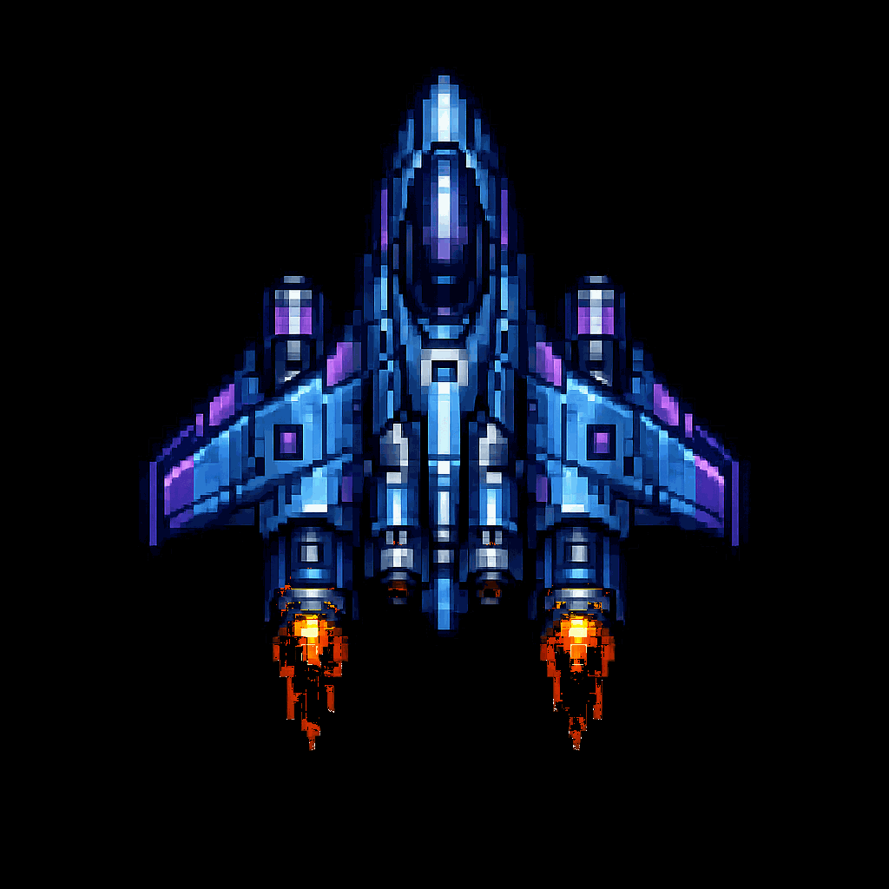

  

### 💡 Turning ideas into reality, one persistent line of code at a time.

 

 

> I'm a **determined and persistent** developer who's always pushing ideas from concept to working product. I don't just like building things — I like *finishing* them.

 

---

## 🛠️ Tech Stack

<table align="center">
<tr>
<td valign="top" align="center" width="20%">

**Languages**
  

</td>
<td valign="top" align="center" width="20%">

**Web**
  

</td>
<td valign="top" align="center" width="20%">

**Frameworks**
  

</td>
<td valign="top" align="center" width="20%">

**Database**
  

</td>
<td valign="top" align="center" width="20%">

**Tools**
  

</td>
</tr>
</table>

 

---

## 🚀 Featured Project

<table align="center">
<tr>
<td width="40%" valign="middle">

### 🎬 CineVibe

A full-stack movie ticket booking platform built as my final-year capstone project — complete seat selection, concession ordering, a loyalty system, and a full admin dashboard, backed by a 40+ table relational database.

**Stack:** Python · Flask · MySQL · JavaScript

</td>
<td width="60%">

</td>
</tr>
</table>

 

---

## 📊 GitHub Stats

<!--
  ⚙️ VERSION B — single compact dashboard (lowlighter/metrics)
  Requires the GitHub Action in .github/workflows/metrics.yml to run at least once.
  Once it runs, it generates github-metrics.svg in your repo — uncomment the line below
  and delete (or comment out) the Version A block beneath it.

  

    
  

-->

 

 

  ✨ Thanks for stopping by — always open to new projects and collaborations.

 

